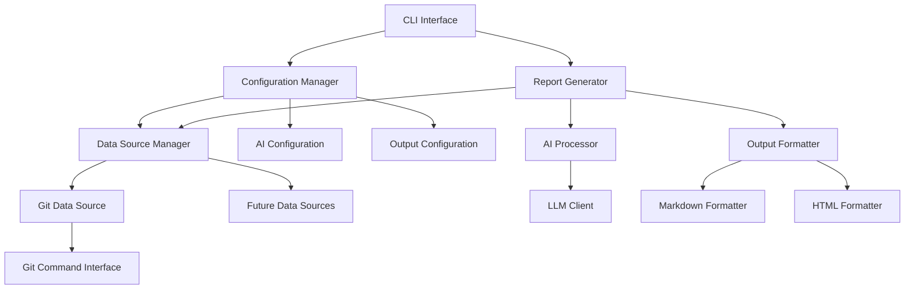

# Design Document

## Overview

The Git Report Generator is a configurable system that automatically generates daily, weekly, and monthly reports by analyzing git commit logs and other data sources. The system uses AI to process raw commit data and generate human-readable reports in markdown or HTML format.

The architecture follows a modular design with pluggable data sources, configurable AI processing, and flexible output formatting to support future extensibility.

## Architecture



## Components and Interfaces

### Configuration Manager
Handles all system configurations including data sources, AI settings, and output preferences.

**Interface:**
```typescript
interface ConfigurationManager {
  loadConfig(): Promise<SystemConfig>
  saveConfig(config: SystemConfig): Promise<void>
  validateConfig(config: SystemConfig): ValidationResult
}

interface SystemConfig {
  dataSources: DataSourceConfig[]
  aiConfig: AIConfiguration
  outputConfig: OutputConfiguration
  reportTypes: ReportTypeConfig[]
}
```

### Data Source Manager
Manages multiple data sources with a pluggable architecture for future extensions.

**Interface:**
```typescript
interface DataSourceManager {
  registerDataSource(source: DataSource): void
  collectData(timeRange: TimeRange, config: DataSourceConfig[]): Promise<CollectedData[]>
}

interface DataSource {
  type: string
  collect(config: DataSourceConfig, timeRange: TimeRange): Promise<RawData>
  validate(config: DataSourceConfig): ValidationResult
}
```

### Git Data Source
Specific implementation for collecting git commit data.

**Implementation Details:**
- Uses `git log` command with customizable parameters
- Supports filtering by author, date range, and repository
- Handles authentication for remote repositories
- Parses commit messages, timestamps, and file changes

### AI Processor
Handles communication with AI models and prompt management.

**Interface:**
```typescript
interface AIProcessor {
  processData(data: CollectedData[], prompt: string, config: AIConfiguration): Promise<ProcessedReport>
  validateConnection(config: AIConfiguration): Promise<boolean>
}

interface AIConfiguration {
  provider: 'openai' | 'anthropic' | 'local'
  apiKey?: string
  model: string
  baseUrl?: string
  customPrompts: Record<ReportType, string>
}
```

### Output Formatter
Converts AI-processed content into final report formats.

**Interface:**
```typescript
interface OutputFormatter {
  format(content: ProcessedReport, format: OutputFormat, config: OutputConfiguration): Promise<string>
}

type OutputFormat = 'markdown' | 'html'
```

## Data Models

### Core Data Models

```typescript
interface GitCommit {
  hash: string
  author: string
  date: Date
  message: string
  filesChanged: string[]
  additions: number
  deletions: number
}

interface CollectedData {
  source: string
  timeRange: TimeRange
  data: GitCommit[] | any[] // Extensible for other data types
}

interface TimeRange {
  start: Date
  end: Date
  type: 'daily' | 'weekly' | 'monthly'
}

interface ProcessedReport {
  title: string
  summary: string
  sections: ReportSection[]
  metadata: ReportMetadata
}

interface ReportSection {
  title: string
  content: string
  priority: number
}
```

### Configuration Models

```typescript
interface GitDataSourceConfig extends DataSourceConfig {
  type: 'git'
  repositories: GitRepository[]
  username?: string
  timeRange: TimeRange
}

interface GitRepository {
  name: string
  path: string
  remote?: string
  branch?: string
  credentials?: GitCredentials
}

interface GitCredentials {
  username: string
  token: string // Personal access token or password
}
```

## Error Handling

### Error Categories
1. **Configuration Errors**: Invalid settings, missing required fields
2. **Data Collection Errors**: Git repository access issues, network failures
3. **AI Processing Errors**: API failures, quota exceeded, invalid responses
4. **Output Generation Errors**: File system issues, formatting failures

### Error Handling Strategy
- **Graceful Degradation**: Continue processing with available data sources if some fail
- **Retry Logic**: Implement exponential backoff for transient failures
- **User Feedback**: Provide clear error messages with actionable suggestions
- **Logging**: Comprehensive logging for debugging and monitoring

### Error Recovery
```typescript
interface ErrorHandler {
  handleDataSourceError(error: DataSourceError, source: string): Promise<void>
  handleAIProcessingError(error: AIError): Promise<ProcessedReport | null>
  handleOutputError(error: OutputError): Promise<void>
}
```

## Testing Strategy

### Unit Testing
- **Configuration Manager**: Test config validation, loading, and saving
- **Data Sources**: Mock git commands, test data parsing and filtering
- **AI Processor**: Mock AI responses, test prompt formatting
- **Output Formatters**: Test markdown and HTML generation

### Integration Testing
- **End-to-End Workflow**: Test complete report generation process
- **Data Source Integration**: Test with real git repositories
- **AI Integration**: Test with actual AI providers (using test accounts)

### Test Data Management
- **Mock Git Repositories**: Create test repositories with known commit history
- **AI Response Mocking**: Pre-recorded AI responses for consistent testing
- **Configuration Fixtures**: Standard test configurations for different scenarios

### Performance Testing
- **Large Repository Handling**: Test with repositories containing thousands of commits
- **Multiple Data Sources**: Test concurrent data collection
- **AI Response Time**: Monitor and test AI processing performance

## Security Considerations

### Credential Management
- Store git credentials securely using system keychain or encrypted storage
- Support for personal access tokens instead of passwords
- Never log or expose credentials in error messages

### AI API Security
- Secure storage of API keys
- Rate limiting and quota management
- Data privacy considerations when sending commit data to external AI services

### File System Security
- Validate output file paths to prevent directory traversal
- Proper file permissions for generated reports
- Secure temporary file handling during processing